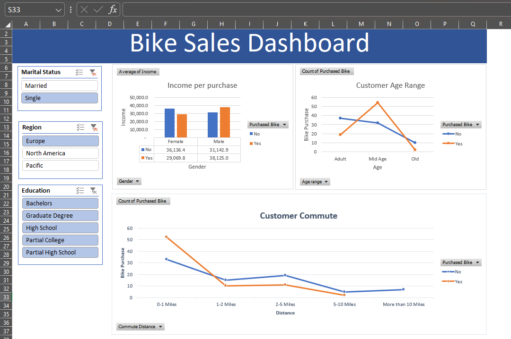

# Bike Sales Dashboard – Excel

## Project Overview

An interactive Bike Sales Dashboard built using Microsoft Excel to analyze customer demographics and purchasing behavior.

The dashboard allows users to filter the analysis using:

- Marital Status
- Region
- Education

## Dashboard Analysis

The dashboard analyzes:

- Income by gender and bike purchase
- Customer age range and bike purchases
- Customer commute distance and bike purchases

## Excel Skills Used

- Data cleaning and preparation
- Excel formulas
- PivotTables
- PivotCharts
- Slicers
- Conditional formatting
- Data visualization
- Dashboard design

## Dashboard Preview

## Tools

- Microsoft Excel

## Dataset

Bike Buyers dataset used for educational/project purposes.

## Key Takeaway

This project demonstrates how Excel can be used to transform customer-level data into an interactive dashboard for exploring purchasing patterns.
